# 🚀 Welcome to My Digital Playground

Hey there, curious mind! You've just stumbled upon the code behind my personal portfolio, a creative fusion of design, development, and dreams. Here, you can explore my world, see what I'm passionate about, and witness the magic I create with code.

## 🌐 See It Live

Why wait? Experience the live version of my portfolio in all its glory right [here](https://dpshetty.netlify.app/). Spoiler alert: It's as awesome as you'd imagine!

## 🖼️ Screenshots

Here’s a glimpse of what you can explore, categorized for different modes and devices:

### 🌙 Web Dark Mode

- **🏠 Home:**
  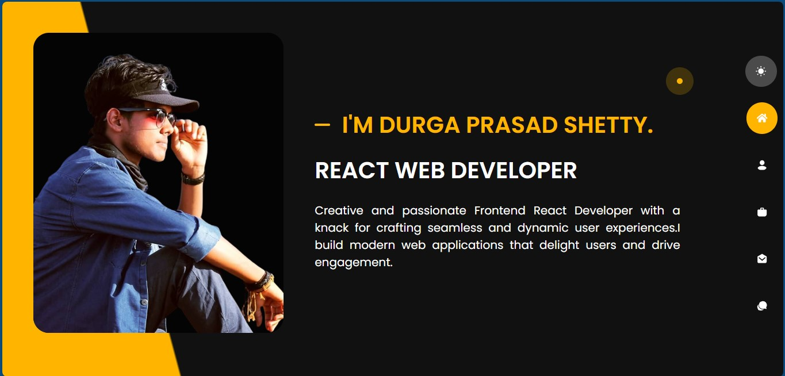

- **👤 About Me:**
  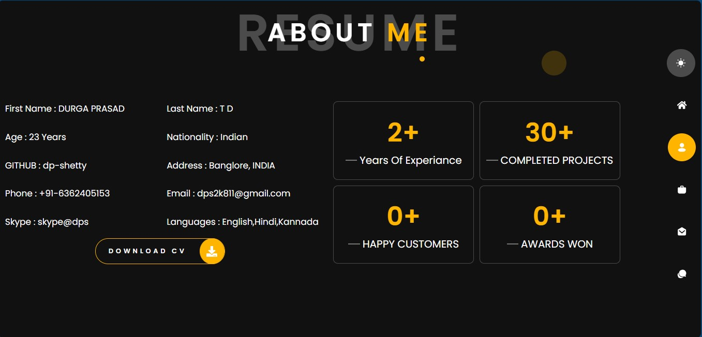

- **💻 Portfolio:**
  

- **🛠️ Contact:**
  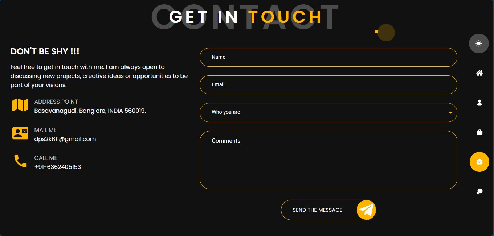

- **📬 Blog:**
  

### 🌞 Web Light Mode

- **🏠 Home:**
  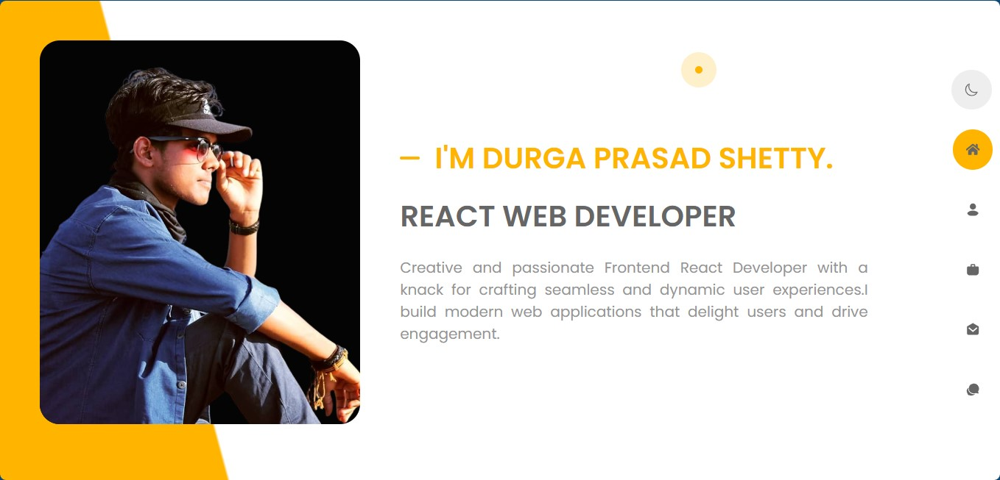

- **👤 About Me:**
  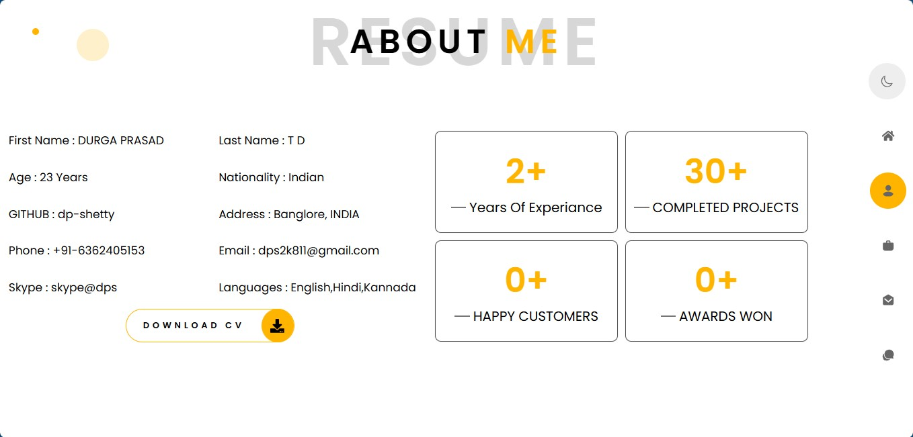

- **💻 Portfolio:**
  

- **🛠️ Contact:**
  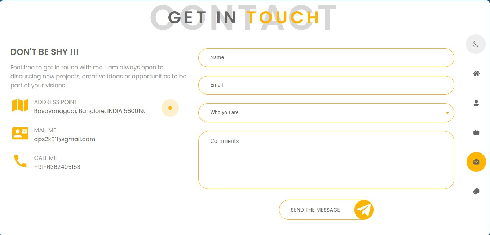

- **📬 Blog:**
  

### 📱 Mobile Dark Mode

- **🏠 Home:**
  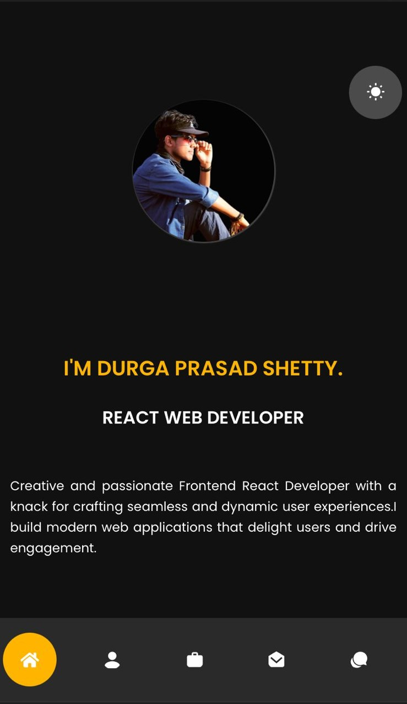

- **👤 About Me:**
  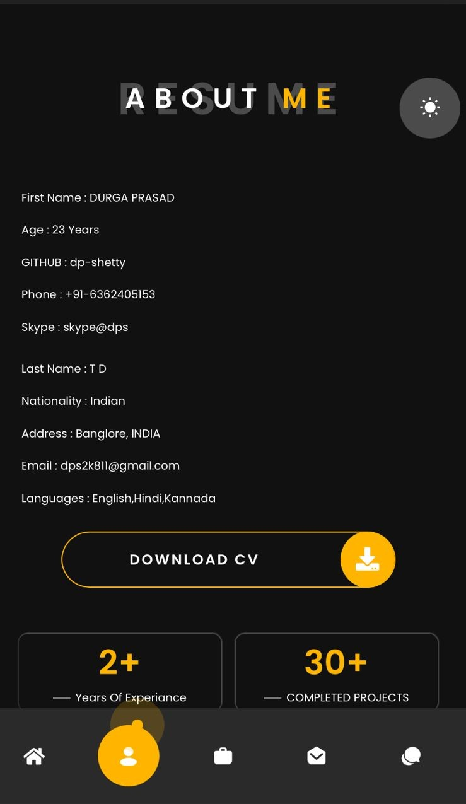

- **💻 Portfolio:**
  )

- **🛠️ Contact:**
  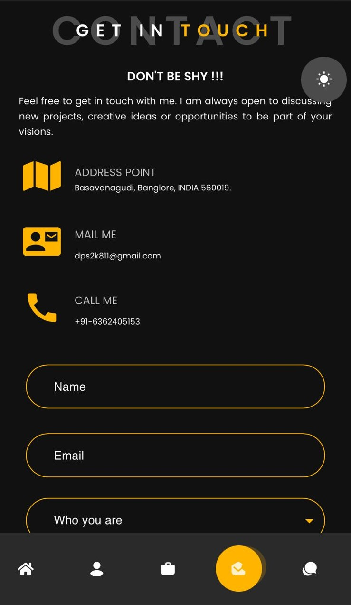

- **📬 Blog:**
  )

### 📱 Mobile Light Mode

- **🏠 Home:**
  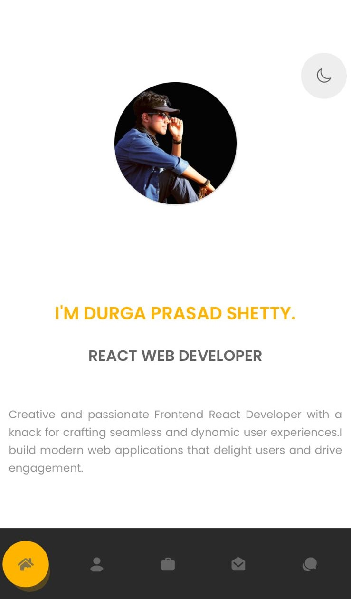

- **👤 About Me:**
  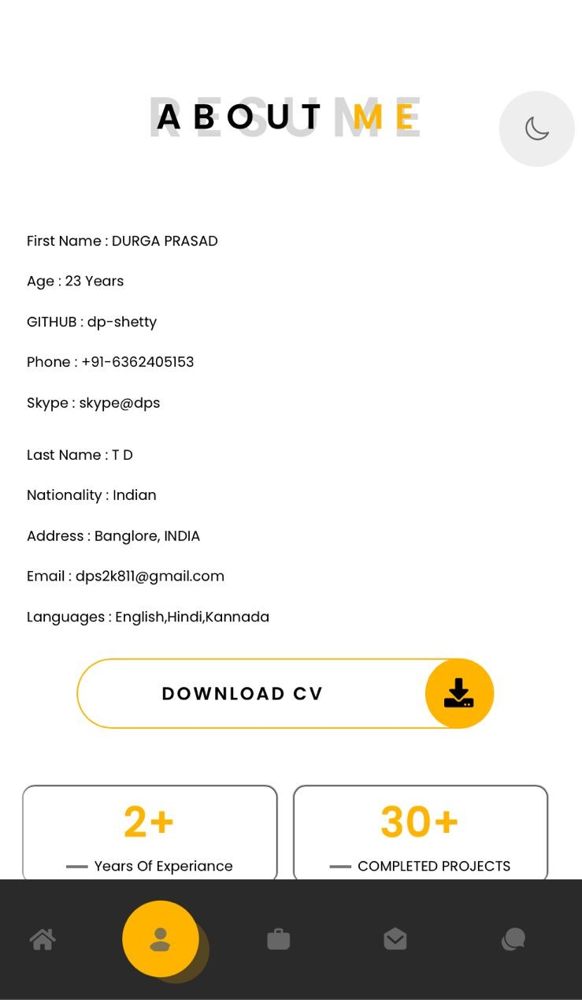

- **💻 Portfolio:**
  

- **🛠️ Contact:**
  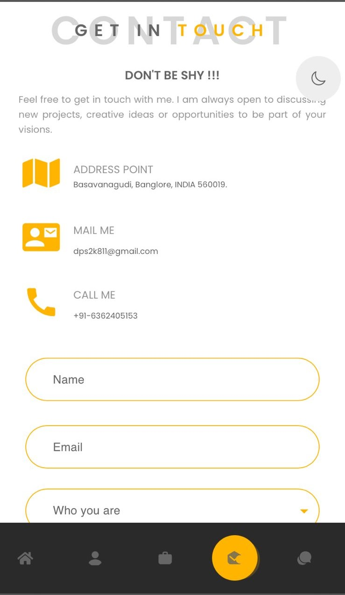

- **📬 Blog:**
  

## 🎨 What Awaits You

- **🏠 Home:** A quick glimpse into my journey as a developer, showcasing my skills and what drives me.
- **👤 About Me:** Get a closer look at the person behind the screen—my story, my passions, and the adventures that have shaped my path.
- **💻 Projects:** A curated collection of my best work, from sleek user interfaces to intricate web apps. Peek under the hood with live demos and source code!
- **🛠️ Skills:** A breakdown of the tools and technologies that I wield like a coding wizard.
- **📬 Contact:** Think we could create something amazing together? Reach out—let’s make it happen!

## 🛠️ Tech Stack

Here's what powers this digital masterpiece:

### Frontend

- **Languages:**
  - **HTML5** 🌐
  - **CSS3** 🎨
  - **JavaScript** 💻
- **Frameworks & Libraries:** 
  - **React.js** ⚛️ for dynamic user interfaces.
  - **Emotion** 🎨 for CSS-in-JS styling.
  - **Redux Toolkit** 🛠️ for state management magic.
  - **React Router 6** 🗺️ for routing.
  - **Material-UI (MUI)** 💅 for sleek components.
  - **Formik** 📋 for form management.
- **Styling:**
  - **Tailwind CSS** 🌬️ for utility-first styling.
  - **SCSS/SASS** ✨ for advanced CSS.
- **Font Scripts:** **Google Font API** 🔠 for custom typography.
- **Deployment:** 
  - **Netlify** 🚀 and **Vercel** 🌟 for hosting.

### Backend

- **Languages:** **Node.js** 🟢
- **Frameworks & Libraries:** 
  - **Express** 🛠️ for web framework and server.
  - **Redux** 🛠️ for state management (shared with frontend).
- **Security:** **HSTS** 🔒 for security headers.
- **Deployment:** **Vercel** 🌟 for seamless backend operations.
- **Live Backend:** Check out the live backend [here](https://your-backend-deployment-url.vercel.app) 🌐

## 🗂️ Backend JSON

Here’s an example of the JSON format used in the backend:

```json
{
  "users": [
    {
      "id": 1,
      "username": "John Doe",
      "useremail": "john.doe@example.com",
      "userrole": "https://via.placeholder.com/150",
      "comments":"fcasdwx"
    },
    {
      "id": 2,
      "username": "Jane Smith",
      "useremail": "jane.smith@example.com",
      "userrole": "https://via.placeholder.com/150",
      "comments":"fcasdwx"
    }
  ]
};


# 🚧 Ready to Dive In?

Fancy a peek behind the scenes? Here’s how you can get started:

1. **Clone the repo:**

   ```bash
   git clone https://github.com/dp-shetty/myPortfolio.git

2. **Navigate to the project directory:**

   ```bash
   cd myPortfolio

3. **Install the goodies:**

   ```bash
   npm install

4. **Fire up the development server:**

   ```bash
   npm run dev

🚀 Deployment & Updates
This site is always up-to-date, thanks to automatic deployments on Netlify and Vercel. Every push to the main branch triggers a fresh deployment—so you’re always seeing the latest and greatest.

🤝 Let’s Collaborate
Got an idea? Found a bug? Or just want to say hi? Feel free to open an issue, submit a pull request, or reach out through my contact page.

📜 License
This project is licensed under the MIT License—because sharing is caring.

📬 Let’s Connect
I’d love to hear from you! Whether it's for a project, a chat, or just to say hi, you can reach me through:

- **Email:** <dps2k811@gmail.com>
- **LinkedIn:** [in/dps811](https://www.linkedin.com/in/dps811/)
  